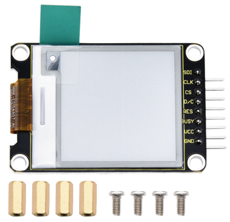
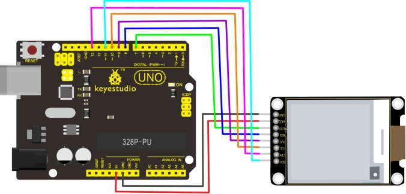
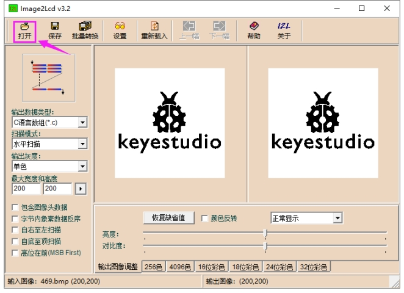
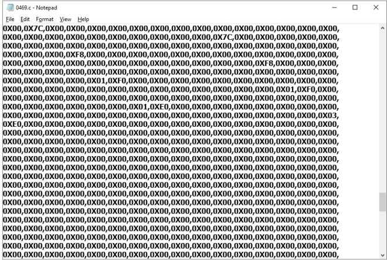
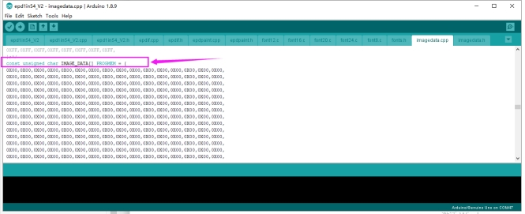
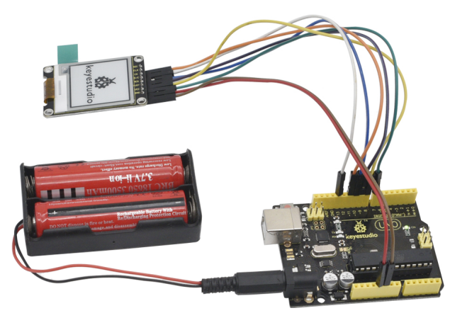

# KS0469 Keyestudio Electronic Ink Screen Module 1.54 Inch

## 1. Description

When we do DIY experiments, we often need to use the display.

The Keyestudio E-screen module has a 1.54-inch display with a black and white color and a resolution of 200*200. The module dynamically displays the pattern via SPI communication.

For your convenience, we also provide detailed methods for using the display module and the arduino microcontroller. At the same time, in order to fix the module on other equipments, the module comes with 4 positioning holes with a diameter of 3mm. We also provide 4 pcs M3 * 10MM double-pass hex copper posts and 4pcs M3 * 6MM round head screws.

Special Note: When testing it, we use the 1.8.9 version of the IDE software, if you use other versions of the IDE, code may be incompatible.

## 2. Technical parameters

- Working voltage: DC 5V
- Working current: 150mA
- Maximum power: 0.75W
- Display color: black and white
- Display size: 1.54 inch
- Display resolution: 200*200
- Interface type: 8pin header with 2.54mm pitch
- Operating temperature range: -20℃ to +60℃
- Positioning hole diameter: 3mm
- Size: 55 * 34 * 7mm
- Weight: 14.5g
- Environmental attributes: ROHS

## 3. Wiring Diagram

## 4. Test code 

Download Resource : [Resource](./Resource.7z)

**The resource pack contains code**

## 5. Code setting method

A. When setting up, we need to install Image2Lcd modulo software. After installation, register with the registration code.

B. Use the drawing software to draw the pattern you need, the export is set to black and white, and the pixel is set to 200*200.

C. Open the modulo software and set the following picture.

Clickto select the pattern you exported, as shown below.

Positive (black on white), then tick "color reversal"; negative display (white on black ) does not need to tick.

Tap “Save”to generate the corresponding C language code file, as shown below.

Copy and paste the generated C language code to the **const unsigned char IMAGE_DATA[] PROGMEM** location in the code, as shown below.

## 6. Test Result

The test code is successfully uploaded. After power-on, the display will display various patterns, as shown below.

